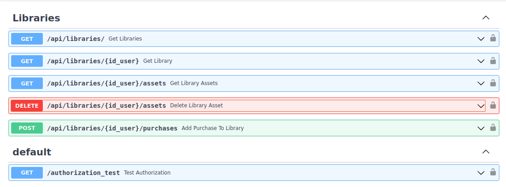

# AIoD Marketplace backend

## Description

This is the repository for the backend managing the assets acquired by users in the AIoD Marketplace. It has two main components:
- A FAST API offering different endpoints to manage the assets, and
- A MongoDB database, persisting the necessary information.

The Marketplace backend is used by the [Marketplace frontend](https://egitlab.iti.es/ai4europe/marketplace-frontend) (private access only for now). 

Authentication and authorization functionalities are currently configured to use the Keycloak instance deployed by the [AIoD REST API](https://github.com/aiondemand/AIOD-rest-api).

 

## Installation

The AIoD Marketplace backend has been implemented to be deployed using Docker compose. In order to start using this backend, follow the steps explained below:

1. Create a copy of the 'app/.env_example' named '.env' 

```
cp app/.env_example app/.env
```

2. Provide the appropriate values for the environment variables defined in '.env'  (Note: if you have doubts on how to do this, contact Sonia at ssantiago@iti.es)

3. Deploy the Docker containers (one running the REST API, and another one running an instance of MongoDB) using Docker compose:

```
docker compose up -d
```

Once this is done:
- The REST API base URL is: http://localhost:8090/api
- The Swagger documentation is available at: http://localhost:8090/docs 
- The data persisted in the MongoDB instance is stored in a  docker volume`marketplace-mylibrary-backend_db`. 

## Usage

The assets purchased by a user are stored in a MongoDB database called "marketplace". More specifically in a collection called "libraries" (the name of the collection can be modified by updating the value of the `DB_LIBRARIES_COLLECTION` environment variable in the .env file). For each user, the AIoD Marketplace backend creates an object in that collection with the following format:

```
{
    "id_user": "string",
    "user_email": "string",
    "assets": [ {asset_model}],
    "created_at": 0,
    "modified_at": 0
}
```

where:
* `id_user`: corresponds to the "sub" property of the user's profile once it has been appropriately authenticated .
* `created_at`, `modified_at`: are timestamps (in seconds) automatically updated by the API.
* property `assets` is a possibly empty list of objects of the form:

```    
{
    "identifier": "string",
    "name": "string",
    "category": "string"
    "url": "string",
    "price": 0,
    "added_at": 0
}
```

where:
 * `identifier` corresponds to the asset `identifier` in the AIoD REST API. 
 * `url_metadata` is the URL of an AIoD REST API instance providing the asset's metadata.
 * `added_at`: is a timestamp (in seconds) automatically updated by the API.

Here is an example of a user's library containing one asset:

```
{
    "id_user": "XXXXXXXX-XXXX-XXXX-XXXX-XXXXXXXXXXXX",
    "user_email": "test_user@gmail.com",
    "assets": [
      {
        "identifier": "1",
        "name": "anneal",
        "category": "dataset",
        "url_metadata": "https://test.openml.org/demo/datasets/v0/1?schema=aiod",
        "price": 0,
        "added_at": 0
      }
    ],
    "created_at": 1691399913,
    "modified_at": 1691399913
}
```

### API's endpoint additional information

The AIoD Marketplace backend's API provides the endpoints shown in the picture below:



Note that:
* Authentication is required for all endpoints. More specifically:
    * Endpoint `GET /api/libraries` is only available for an admin user (currently, the one denoted by the MKTPLC_ADMIN_ID environment variable, but in the future this will be a role-based check)
    * The rest of the endpoints are available for and admin user, and for authenticated user with id_user == `{id_user}`-
* Endpoint `POST /api/libraries/{id_user}/purchases` allows to add the purchased assets to the user's library. The first time a user purchases assets, creates the user's "library" object in the database, with the purchased assets. 
* Endpoint `DELETE /api/libraries/{id_user}/assets/{identifier}` allows to remove an asset with identifier == `{identifier}` from the `{id_user}` user's library.


## Authors and acknowledgment

For any question, contact Sonia Santiago (ssantiago@iti.es) and Pilar Piqueres (ppiqueres@iti.es)
 
